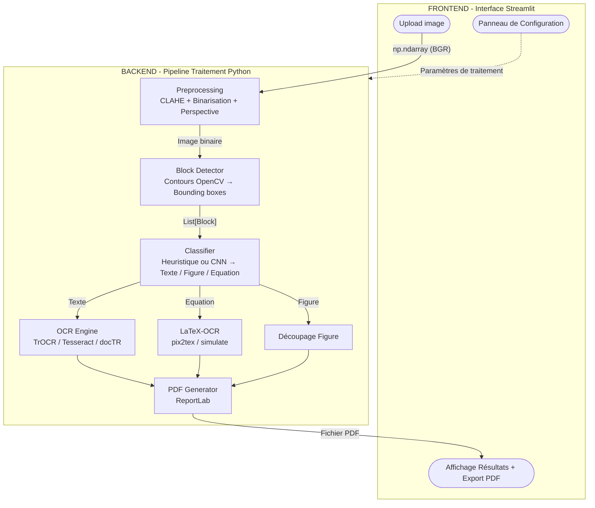

# Architecture du Projet - Pipeline OCR Tableau Blanc

L'application est structurée autour d'une architecture unifiée Frontend/Backend, orchestrée par Streamlit. Cette approche permet une interaction fluide avec l'utilisateur tout en garantissant des performances élevées sur le traitement d'images et l'inférence des modèles d'intelligence artificielle.

## Schéma d'Architecture (Backend / Frontend)

## Description des Composants

### Frontend (Interface Streamlit)
L'interface web permet à l'utilisateur :
- D'**uploader** une photo de tableau blanc native (sans redimensionnement préalable).
- De **configurer** de manière interactive les moteurs d'IA (Tesseract, TrOCR, docTR, utilisation du LLM pour correction...).
- De **visualiser** les résultats d'inférence en direct (Image binarisée, textes bruts et corrigés, formules exactes) et de les **éditer** avant l'exportation finale PDF.

### Backend (Pipeline de traitement Python)
Le backend traite séquentiellement l'image envoyée via le pipeline :

1. **Preprocessing** : Harmonise l'éclairage du tableau blanc via CLAHE (Contrast Limited Adaptive Histogram Equalization) et applique une binarisation adaptative pour ressortir les traits.
2. **Block Detector** : Réalise une segmentation de la page. Les algorithmes extraient les contours de l'image binarisée et séparent les éléments de contenu en blocs (Bounding Boxes).
3. **Classifier** : Analyse chaque bloc indépendamment pour déterminer s'il s'agit de texte simple, de formules mathématiques ou de croquis vectoriels/schémas.
4. **Moteurs Spécialisés** : Le backend délègue intelligemment la reconnaissance selon le type :
    - *Modèles OCR orientés texte* (TrOCR ou Tesseract) traduisent les blocs de texte.
    - *Modèles LaTeX-OCR* déchiffrent la reconnaissance mathématique formelle.
    - Les figures sont directement recadrées (crop) pour être insérées en tant qu'images.
5. **Générateur PDF** : Compile le texte post-traité (par correction LLM), les formules et les figures d'illustration dans un rendu final organisé via ReportLab.
