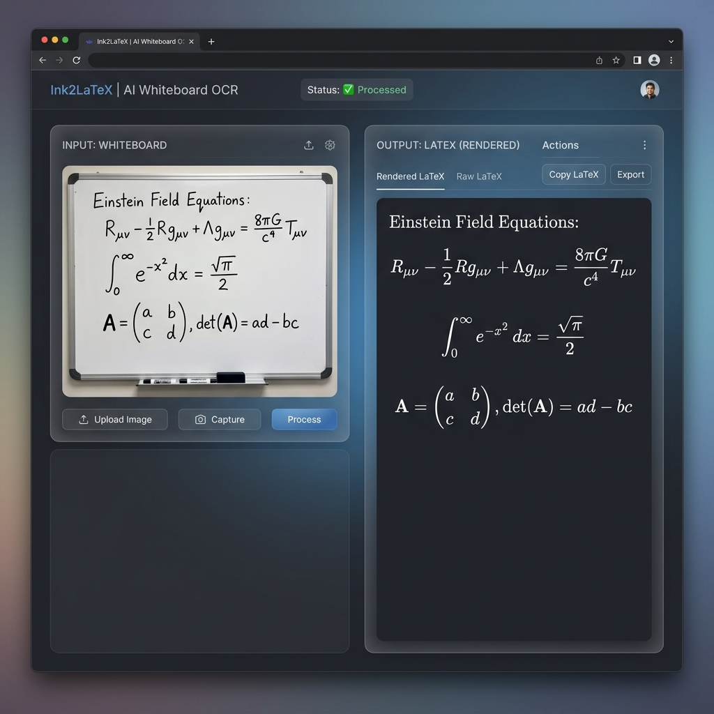

# 🧠 OCR Tableau Blanc — Application Web V2

> **Projet Majeur IA · ESAIP · IR4-S8 · 2025–2026**



## Ce que fait l'application
Notre application web convertit instantanément les photos de vos tableaux blancs en documents PDF propres et exploitables, en extrayant intelligemment le texte manuscrit, les formules mathématiques et les croquis (figures). 

## 🚀 Installation Rapide

```bash
# 1. Cloner le dépôt et entrer dans le dossier
# git clone <url_du_repo>
cd AC_ES

# 2. Créer l'environnement virtuel et l'activer
python -m venv venv
source venv/Scripts/activate  # Sur Windows: venv\Scripts\activate ou venv\bin\activate (Linux/Mac)

# 3. Installer les dépendances
pip install -r requirements.txt

# 4. Lancer l'interface web (Frontend)
streamlit run app.py
```
> **Note** : Tesseract OCR nécessite d'être installé sur votre machine. Sur Windows, téléchargez l'exécutable [ici](https://github.com/UB-Mannheim/tesseract/wiki). Sur Linux : `sudo apt-get install tesseract-ocr`.

## 🏗️ Architecture

L'application est structurée autour d'une interface web (Streamlit) interconnectée avec un puissant pipeline Python assurant des opérations successives de prétraitement, d'analyse ML et de génération de documents.

👉 **[Voir le Schéma d'Architecture Détaillé](ARCHITECTURE.md)**

## 🤖 Modèles OCR Disponibles
L'une des forces du pipeline est de proposer au choix 3 moteurs selon le besoin de l'utilisateur :
- **Tesseract 5** : (Par défaut) très rapide et performant sur du texte "imprimé" ou régulier.
- **TrOCR** *(Microsoft)* : Modèle de Deep Learning pré-entraîné (architecture vision-Transformer), hautement recommandé pour reconnaître de l'écriture manuscrite sur le tableau.
- **docTR** *(Mindee)* : Apporte la reconnaissance en deux étapes (détection des mots puis reconnaissance), actuellement en cours de fine-tuning par notre équipe.

## 🌟 Fonctionnalités Principales
- **Pipeline Intégral :** Upload d'image brute → Prétraitement et Binarisation → Détection spatiale → Reconnaissance de texte → Export au format PDF.
- **Classification Sémantique :** Les éléments du tableau sont séparés afin de distinguer le texte libre, les blocs mathématiques, et les blocs graphiques (schémas, dessins sauvés en tant qu'images croppées).
- **Correction Intelligente (LLM) :** Le module correcteur permet d'atténuer les éventuelles coquilles de l'OCR sur le texte final.
- **Équations Mathématiques :** Traduction des blocs LaTeX isolés.

---

## 👥 Équipe Projet

- **Membre 1** : Capture + Intégration globale du pipeline backend/frontend.
- **Membre 2** : Prétraitement (CLAHE, Binarisation adaptative, Perspective).
- **Membre 3** : ML #1 — Classification vectorielle des Layouts/Blocs.
- **Membre 4** : Augmentation logicielle "Whiteboard-style" pour la baseline de données.
- **Membre 5** : ML #2 — Fine-tuning du modèle docTR + Intégration modèles externes (TrOCR).
- **Membre 6** : Architecture formelle locale & Export en ReportLab.
